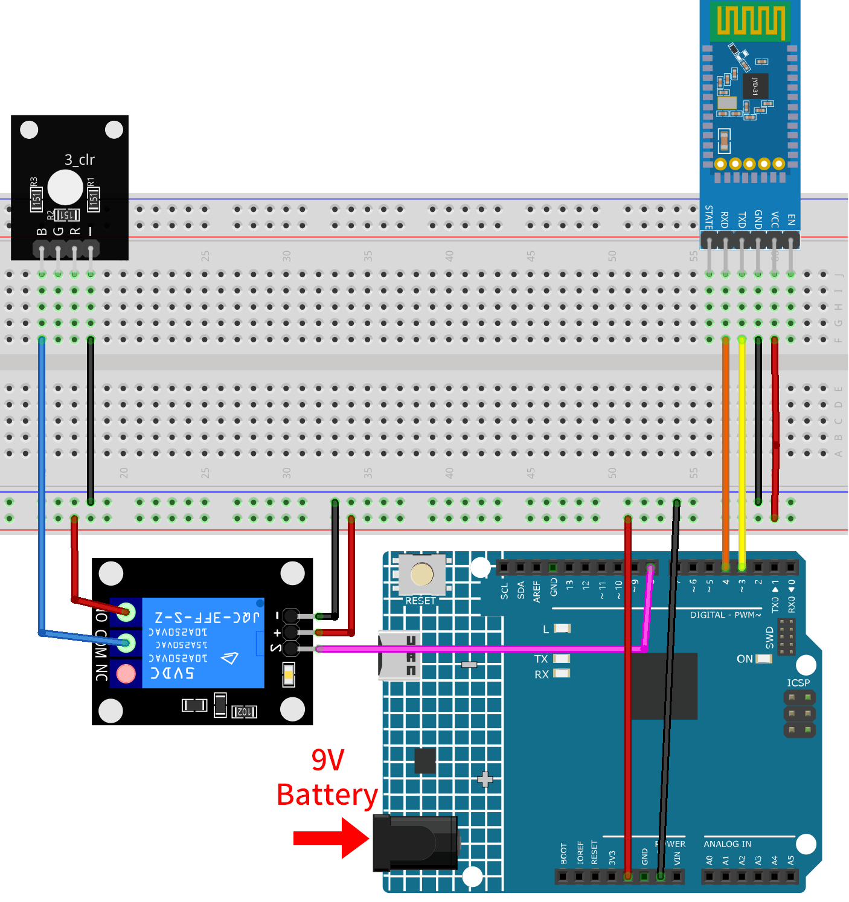

.. note::

    Hallo und willkommen in der SunFounder Raspberry Pi & Arduino & ESP32 Enthusiasten-Gemeinschaft auf Facebook! Tauchen Sie tiefer ein in die Welt von Raspberry Pi, Arduino und ESP32 mit anderen Enthusiasten.

    **Warum beitreten?**

    - **Expertenunterstützung**: Lösen Sie Nachverkaufsprobleme und technische Herausforderungen mit Hilfe unserer Gemeinschaft und unseres Teams.
    - **Lernen & Teilen**: Tauschen Sie Tipps und Anleitungen aus, um Ihre Fähigkeiten zu verbessern.
    - **Exklusive Vorschauen**: Erhalten Sie frühzeitigen Zugang zu neuen Produktankündigungen und exklusiven Einblicken.
    - **Spezialrabatte**: Genießen Sie exklusive Rabatte auf unsere neuesten Produkte.
    - **Festliche Aktionen und Gewinnspiele**: Nehmen Sie an Gewinnspielen und Feiertagsaktionen teil.

    👉 Sind Sie bereit, mit uns zu erkunden und zu erschaffen? Klicken Sie auf [|link_sf_facebook|] und treten Sie heute bei!

.. _iot_Bluetooth_remote_relay:

Bluetooth-Fernrelais
=================================

.. raw:: html

   <video loop autoplay muted style = "max-width:100%">
      <source src="../_static/video/iot/13-iot_Bluetooth_remote_relay.mp4"  type="video/mp4">
      Ihr Browser unterstützt das Video-Tag nicht.
   </video>

Dieses Projekt nutzt eine mit MIT App Inventor erstellte Android-App, um ein Relaismodul über das JDY-31 Bluetooth-Modul, welches an einen Arduino Uno angeschlossen ist, fernzusteuern. Wenn in der App ein Button gedrückt wird, sendet sie einen einfachen Befehl ('1' oder '0') an den Arduino. Erhält der Arduino den Befehl '1' via Bluetooth, wird das Relais aktiviert; bei Erhalt des Befehls '0' wird es deaktiviert. Dies bietet eine benutzerfreundliche Schnittstelle auf dem Smartphone zur Steuerung von an das Relais angeschlossenen Geräten.

Die Android-Anwendung wird auf einer kostenlosen webbasierten Plattform namens |link_appinventor| erstellt. Das Projekt bietet eine hervorragende Gelegenheit, sich mit der Schnittstelle zwischen einem Arduino und einem Smartphone vertraut zu machen.

1. Schaltung aufbauen
-----------------------------

.. warning ::
    Das folgende Beispiel zeigt, wie ein Relais zur Steuerung eines LED-Moduls verwendet wird. 
    **Obwohl es möglich ist, das Relais in realen Anwendungen mit anderen Geräten zu verbinden, ist bei der Arbeit mit HOHER Wechselspannung äußerste Vorsicht geboten. Unachgemäße oder fehlerhafte Verwendung kann zu schweren Verletzungen oder gar zum Tod führen. Dieses Projekt richtet sich daher an Personen, die sich mit HOHER Wechselspannung auskennen und diese sicher handhaben können. Sicherheit hat immer Vorrang.**

* :ref:`cpn_uno`
* :ref:`cpn_jdy31`
* :ref:`cpn_relay`
* :ref:`cpn_rgb`

2. Android-App erstellen
-----------------------------

Die Android-Anwendung wird mit einer kostenlosen Webanwendung namens |link_appinventor| entwickelt.
MIT App Inventor eignet sich hervorragend als Einstieg in die Android-Entwicklung, dank seiner intuitiven Drag-and-Drop-Funktionen zur Erstellung einfacher Applikationen.

Nun legen wir los.

#. Gehen Sie zu |link_appinventor_login| und klicken Sie auf "Online-Tool" zum Einloggen. Ein Google-Konto ist zur Registrierung bei MIT App Inventor erforderlich.

   .. image:: img/new/09-ai_signup_shadow.png
       :width: 90%
       :align: center

#. Nach dem Einloggen navigieren Sie zu **Projects** -> **Import project (.aia) from my computer**. Laden Sie anschließend die Datei ``RemoteRelay.aia`` hoch, die im Pfad ``ultimate-sensor-kit\iot_project\bluetooth\08-Bluetooth_remote_relay`` zu finden ist.

   Direkter Download hier: :download:`RemoteRelay.aia</_static/other/RemoteRelay.aia>`

   .. image:: img/new/09-ai_import_shadow.png
        :align: center

#. Nach dem Hochladen der ``.aia``-Datei sehen Sie die Anwendung in der MIT App Inventor-Software. Dies ist eine vorkonfigurierte Vorlage. Nachdem Sie sich mit MIT App Inventor vertraut gemacht haben, können Sie diese Vorlage entsprechend modifizieren.

#. In MIT App Inventor gibt es zwei Hauptbereiche: den **Designer** und die **Blocks**. Zwischen diesen beiden Bereichen können Sie oben rechts auf der Seite umschalten.

   .. image:: img/new/09-ai_intro_1_shadow.png

#. Der **Designer** ermöglicht das Hinzufügen von Buttons, Texten, Bildschirmen und die allgemeine ästhetische Gestaltung Ihrer Anwendung.

   .. image:: img/new/13-ai_intro_2_shadow.png
   
#. Als Nächstes gibt es den Bereich **Blocks**. Hier können Sie spezielle Funktionalitäten für Ihre App programmieren und jedes Element in der Benutzeroberfläche der App entsprechend konfigurieren.

   .. image:: img/new/13-ai_intro_3_shadow.png

#. Um die Anwendung auf einem Smartphone zu installieren, navigieren Sie zur Registerkarte **Build**.

   .. image:: img/new/08-ai_intro_4_shadow.png

   * Hier können Sie eine ``.apk``-Datei generieren. Nach der Auswahl dieser Option wird eine Seite angezeigt, auf der Sie zwischen dem Herunterladen einer ``.apk``-Datei oder dem Scannen eines QR-Codes zur Installation wählen können. Folgen Sie der Installationsanleitung, um die Installation der Anwendung abzuschließen.

     Die vorab kompilierte APK können Sie hier herunterladen: :download:`RemoteRelay.apk</_static/other/RemoteRelay.apk>`

   * Wenn Sie diese App im Google Play Store oder einem anderen App-Marktplatz hochladen möchten, können Sie eine ``.aab``-Datei generieren.

3. Den Code hochladen
-----------------------------

#. Öffnen Sie die Datei ``08-Bluetooth_remote_relay.ino`` im Pfad ``ultimate-sensor-kit\iot_project\bluetooth\08-Bluetooth_remote_relay`` oder kopieren Sie den Code in die **Arduino IDE**.

   .. raw:: html
       
       <iframe src=https://create.arduino.cc/editor/sunfounder01/97039b6d-f77f-481c-a92e-c7667fc2d4cc/preview?embed style="height:510px;width:100%;margin:10px 0" frameborder=0></iframe>

#. Nach der Auswahl des richtigen Boards und Ports klicken Sie auf die Schaltfläche **Hochladen**.

#. Öffnen Sie den seriellen Monitor (Baudrate auf **9600** einstellen), um Debug-Meldungen anzuzeigen.

4. Verbindung zwischen App und Bluetooth-Modul herstellen
-------------------------------------------------------------------

Vergewissern Sie sich, dass die zuvor erstellte Anwendung auf Ihrem Smartphone installiert ist.

#. Aktivieren Sie zunächst **Bluetooth** auf Ihrem Smartphone.

   .. image:: img/new/09-app_1_shadow.png
      :width: 60%
      :align: center

#. Navigieren Sie zu den **Bluetooth-Einstellungen** auf Ihrem Smartphone und suchen Sie nach Namen wie **JDY-31-SPP**.

   .. image:: img/new/09-app_2_shadow.png
      :width: 60%
      :align: center

#. Klicken Sie darauf und stimmen Sie der **Kopplungsanfrage** im Popup-Fenster zu. Falls ein Kopplungscode erforderlich ist, geben Sie "1234" ein.

   .. image:: img/new/09-app_3_shadow.png
      :width: 60%
      :align: center

#. Öffnen Sie nun die neu installierte **Remote Relay**-App.

   .. image:: img/new/13-app_4_shadow.png
      :width: 25%
      :align: center

#. In der App klicken Sie auf die Schaltfläche **Connect**, um eine Verbindung zwischen der App und dem Bluetooth-Modul herzustellen.

   .. image:: img/new/13-app_5_shadow.png
      :width: 60%
      :align: center

#. Diese Seite zeigt eine Liste aller gekoppelten Bluetooth-Geräte an. Wählen Sie die Option ``xx.xx.xx.xx.xx.xx JDY-31-SPP`` aus der Liste aus. Der Name jedes Geräts wird neben seiner MAC-Adresse aufgelistet.

   .. image:: img/new/13-app_6_shadow.png
      :width: 60%
      :align: center

#. Falls Sie auf der oben angezeigten Seite keine Geräte sehen, könnte dies daran liegen, dass der App die Berechtigung zum Scannen von Geräten in der Nähe fehlt. In diesem Fall müssen Sie die Einstellungen manuell anpassen.

   * Um zur Seite **App-Informationen** zu gelangen, halten Sie das App-Symbol lange gedrückt und wählen Sie es aus. Alternativ können Sie jede andere Methode verwenden, um diese Seite zu erreichen.

   .. image:: img/new/13-app_8_shadow.png
         :width: 60%
         :align: center

   * Navigieren Sie zur Seite **Berechtigungen**.

   .. image:: img/new/08-app_9_shadow.png
         :width: 60%
         :align: center

   * Um der App das Scannen von Geräten in der Nähe zu ermöglichen, gehen Sie zu **Geräte in der Nähe** und wählen **Immer**.

   .. image:: img/new/08-app_10_shadow.png
         :width: 60%
         :align: center

   * Starten Sie nun die App neu und wiederholen Sie die Schritte 5 und 6, um erfolgreich eine Bluetooth-Verbindung herzustellen.

#. Nach erfolgreicher Verbindung werden Sie zur Hauptseite weitergeleitet. Klicken Sie auf "ON" oder "OFF", um das Relais ein- oder auszuschalten.

   .. note ::
      Wenn die MAC-Adresse des Bluetooth "1" enthält, wird das Relais bei der ersten erfolgreichen Bluetooth-Verbindung eingeschaltet und dann schnell wieder ausgeschaltet. Denn beim Herstellen der Bluetooth-Verbindung wird die MAC-Adresse an den Arduino gesendet. Der Arduino erkennt "1" und schaltet das Relais ein. Nach der Bluetooth-Initialisierung sendet die App eine 0 an den Arduino über Bluetooth, um sicherzustellen, dass der Anfangszustand des Relais nach der Verbindung geschlossen ist.

   .. image:: img/new/13-app_7_shadow.png
      :width: 60%
      :align: center

5. Code-Erläuterung
-----------------------------------------------

1. **Bibliothek und globale Variableninitialisierung**

   .. code-block:: arduino
   
       #include <SoftwareSerial.h>
   
       const int bluetoothTx = 3;                           
       const int bluetoothRx = 4;                           
       SoftwareSerial bleSerial(bluetoothTx, bluetoothRx);
   
       const int relayPin = 8;

   Dieses Segment bindet die ``SoftwareSerial``-Bibliothek ein und initialisiert die globalen Variablen. Die Pins 3 und 4 sind für die Datenübertragung und den Datenempfang mit dem Bluetooth-Modul definiert. Zudem ist das Relaismodul an Pin 8 angeschlossen.

2. **Funktion setup()**

   .. code-block:: arduino
   
       void setup() {
         Serial.begin(9600);
         bleSerial.begin(9600);
         pinMode(relayPin, OUTPUT);
       }

   Die Funktion startet den seriellen Monitor und die Kommunikation mit dem Bluetooth-Modul mit einer Baudrate von 9600. Sie legt außerdem den ``relayPin`` als Ausgangspin fest.

3. **Funktion loop()**

   .. code-block:: arduino
   
       void loop() {
         if (bleSerial.available() > 0) {
           char message = bleSerial.read();
           // Serial.println(message);  //for debug
   
           if (message == '1') {
             digitalWrite(relayPin, HIGH);
             Serial.println("On");
           } else if (message == '0') {
             digitalWrite(relayPin, LOW);
             Serial.println("Off");
           }
         }
       }

   Die ``loop()``-Funktion wird fortlaufend ausgeführt. Sie prüft, ob eine Nachricht vom Bluetooth-Modul empfangen wurde. Falls ja, liest sie das Zeichen aus. Abhängig vom empfangenen Zeichen ('1' oder '0') wird das Relais aktiviert oder deaktiviert und eine Bestätigungsnachricht ("Eingeschaltet" oder "Ausgeschaltet") an den seriellen Monitor gesendet.

