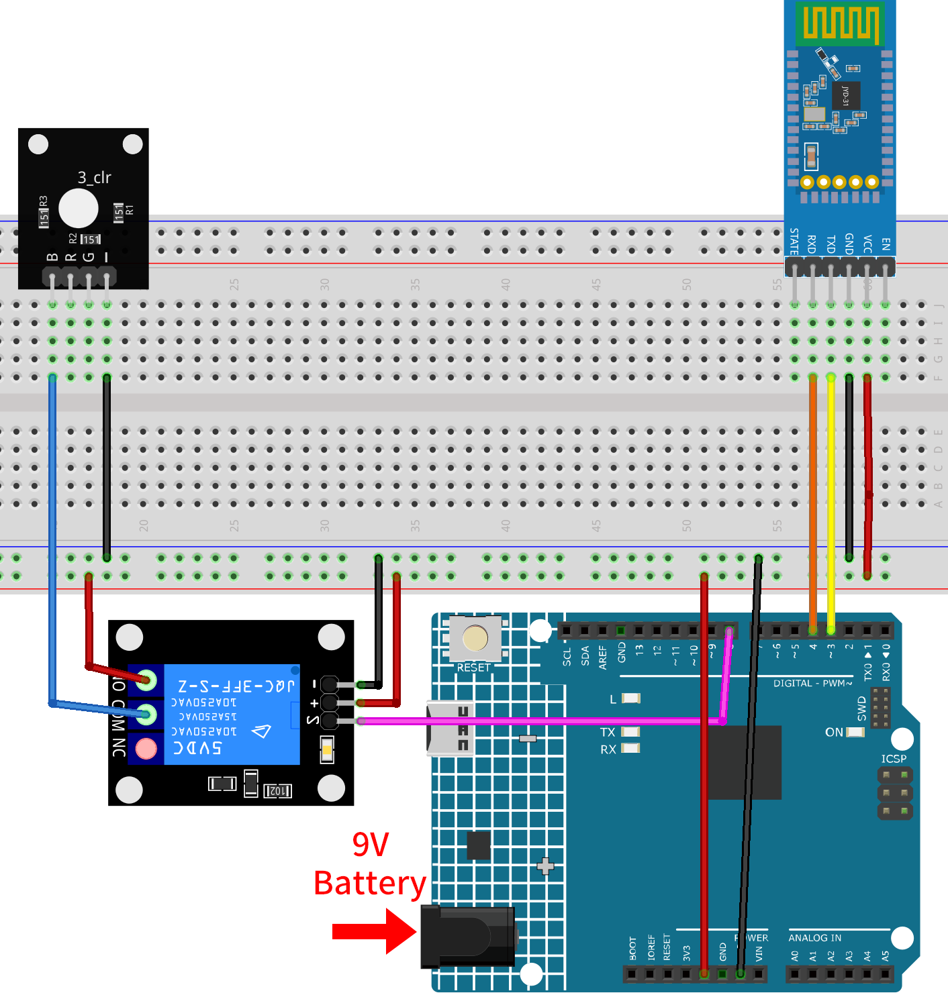

.. _iot_Bluetooth_remote_relay:

Bluetooth remote relay
=================================

.. raw:: html

   <video loop autoplay muted style = "max-width:100%">
      <source src="../_static/video/iot/13-iot_Bluetooth_remote_relay.mp4"  type="video/mp4">
      Your browser does not support the video tag.
   </video>

This project uses an Android app created with MIT App Inventor to remotely control a relay module through the JDY-31 Bluetooth module connected to an Arduino Uno. When the app's buttons are pressed, it sends a simple command ('1' or '0') to the Arduino. When the Arduino receives the command '1' via Bluetooth, it activates the relay, and when it receives '0', it deactivates the relay. This provides a user-friendly interface on a smartphone to control devices connected to the relay.

The Android application will be constructed utilizing a complimentary web-based platform known as |link_appinventor|. The project presents an excellent opportunity to gain familiarity with the interfacing of an Arduino with a smartphone. 

1. Build the Cirduit
-----------------------------

.. warning ::
    The following example demonstrates using a relay to control an LED module. 
    **While you can connect the relay to other appliances in actual applications, extreme caution is required when dealing with HIGH AC voltage. Improper or incorrect use can lead to severe injury or even death. Therefore, it is intended for people who are familiar with and knowledgeable about HIGH AC voltage. Always prioritize safety.**

* :ref:`cpn_uno`
* :ref:`cpn_jdy31`
* :ref:`cpn_relay`
* :ref:`cpn_rgb`

2. Create the Android App
-----------------------------

The Android application will be developed using a free web application known as |link_appinventor|. 
MIT App Inventor serves as an excellent starting point for Android development, owing to its intuitive drag-and-drop 
features allowing for the creation of simplistic applications.

Now, let's begin.

#. Go to |link_appinventor_login|, and click "online tool" to login. You will require a Google account to register with MIT App Inventor.

   .. image:: img/new/09-ai_signup_shadow.png
       :width: 90%
       :align: center

#. After logging in, navigate to **Projects** -> **Import project (.aia) from my computer**. Subsequently, upload the ``RemoteRelay.aia`` file located in the path ``ultimate-sensor-kit\iot_project\13-Bluetooth_remote_relay``.

   You can also directly download here: :download:`RemoteRelay.aia</_static/other/RemoteRelay.aia>`

   .. image:: img/new/09-ai_import_shadow.png
        :align: center

#. Upon uploading the ``.aia`` file, you will see the application on the MIT App Inventor software. This is a pre-configured template. You can modify this template after you have familiarized yourself with MIT App Inventor through the following steps.

#. In MIT App Inventor, you have 2 primary sections: the **Designer** and the **Blocks**. You can switch between these two sections in the upper right corner of the page.

   .. image:: img/new/09-ai_intro_1_shadow.png

#. The **Designer** allows you to add buttons, text, screens, and modify the overall aesthetic of your application.

   .. image:: img/new/13-ai_intro_2_shadow.png
   
#. Next, there's the **Blocks** section. This section lets you craft custom functionalities for your app, allowing you to program each component on the app's GUI to achieve desired features.

   .. image:: img/new/13-ai_intro_3_shadow.png

#. To install the application on a smartphone, navigate to the **Build** tab.

   .. image:: img/new/08-ai_intro_4_shadow.png

   * You can generate a ``.apk`` file. After selecting this option, a page will appear allowing you to choose between downloading a ``.apk`` file or scanning a QR code for installation. Follow the installation guide to complete the application installation. 

     You also download our pre-compiled APK here: :download:`RemoteRelay.apk</_static/other/RemoteRelay.apk>`

   * If you wish to upload this app to Google Play or another app marketplace, you can generate a ``.aab`` file.

3. Upload the Code
-----------------------------

#. Open the ``13-Bluetooth_remote_relay.ino`` file under the path of ``ultimate-sensor-kit\iot_project\13-Bluetooth_remote_relay``, or copy this code into **Arduino IDE**.

   .. raw:: html
       
       <iframe src=https://create.arduino.cc/editor/sunfounder01/97039b6d-f77f-481c-a92e-c7667fc2d4cc/preview?embed style="height:510px;width:100%;margin:10px 0" frameborder=0></iframe>

#. After selecting the correct board and port, click the **Upload** button.

#. Open the Serial monitor(set baudrate to **9600**) to view debug messages. 

4. App and Bluetooth moudule Connection
-----------------------------------------------

Ensure that the application created earlier is installed on your smartphone.

#. Initially, turn on **Bluetooth** on your smartphone.

   .. image:: img/new/09-app_1_shadow.png
      :width: 60%
      :align: center

#. Navigate to the **Bluetooth settings** on your smartphone and look for names like **JDY-31-SPP**.

   .. image:: img/new/09-app_2_shadow.png
      :width: 60%
      :align: center

#. After clicking it, agree to the **Pair** request in the pop-up window. If prompted for a pairing code, please enter "1234".

   .. image:: img/new/09-app_3_shadow.png
      :width: 60%
      :align: center

#. Now open the newly installed **Remote Relay** APP.

   .. image:: img/new/13-app_4_shadow.png
      :width: 25%
      :align: center

#. In the APP, click on **Connect** button to establish a connection between the APP and Bluetooth module.

   .. image:: img/new/13-app_5_shadow.png
      :width: 60%
      :align: center

#. This page displays a list of all paired Bluetooth devices. Choose the ``xx.xx.xx.xx.xx.xx JDY-31-SPP`` option from the list. The name of each device is listed next to its MAC address.

   .. image:: img/new/13-app_6_shadow.png
      :width: 60%
      :align: center

#. If you don't see any devices on the page shown above, it could be because this app is not authorized to scan for nearby devices. In such a case, you will need to adjust the settings manually.

   * To access the **APP Info** page, long-press the app icon and select it. Alternatively, if you have another method to reach this page, use that instead.

   .. image:: img/new/13-app_8_shadow.png
         :width: 60%
         :align: center

   * Navigate to the **Permissions** page.

   .. image:: img/new/08-app_9_shadow.png
         :width: 60%
         :align: center

   * To enable the APP to scan for nearby devices, go to **Nearby devices** and select **Always**.

   .. image:: img/new/08-app_10_shadow.png
         :width: 60%
         :align: center

   * Now, restart the APP and repeat steps 5 and 6 to successfully connect to Bluetooth.

#. After a successful connection, you will be redirected to the main page. Click the "ON" or "OFF" button to turn on or off the relay.

   .. note ::
      When the MAC address of Bluetooth contains "1", the relay will be turned on and then quickly turned off after the first successful Bluetooth connection. Because when the Bluetooth is connected, the MAC address will be sent to Arduino. Arduino detects "1" and then opens the relay. After Bluetooth initialization, the app sends 0 to Arduino via Bluetooth to ensure that the initial state of the relay is closed after connection.

   .. image:: img/new/13-app_7_shadow.png
      :width: 60%
      :align: center

5. Code explanation
-----------------------------------------------

1. **Library and Global Variable Initialization**

   .. code-block:: arduino
   
       #include <SoftwareSerial.h>
   
       const int bluetoothTx = 3;                           
       const int bluetoothRx = 4;                           
       SoftwareSerial bleSerial(bluetoothTx, bluetoothRx);
   
       const int relayPin = 8;

   This segment includes the ``SoftwareSerial`` library and sets up the global variables. Pins 3 and 4 are defined for transmitting and receiving data with the Bluetooth module, respectively. Additionally, the relay module is connected to pin 8.

2. **setup() Function**

   .. code-block:: arduino
   
       void setup() {
         Serial.begin(9600);
         bleSerial.begin(9600);
         pinMode(relayPin, OUTPUT);
       }
   
   It initiates the Serial monitor and Bluetooth module communication at a baud rate of 9600. It also sets the ``relayPin`` as an OUTPUT pin.

3. **loop() Function**

   .. code-block:: arduino
   
       void loop() {
         if (bleSerial.available() > 0) {
           char message = bleSerial.read();
           // Serial.println(message);  //for debug
   
           if (message == '1') {
             digitalWrite(relayPin, HIGH);
             Serial.println("On");
           } else if (message == '0') {
             digitalWrite(relayPin, LOW);
             Serial.println("Off");
           }
         }
       }
   
   The ``loop()`` function runs continuously. It checks if there's a message received from the Bluetooth module. If a message is received, it reads the character. Depending on the character ('1' or '0'), it either turns the relay on or off and sends a confirmation message ("On" or "Off") to the Serial monitor.
