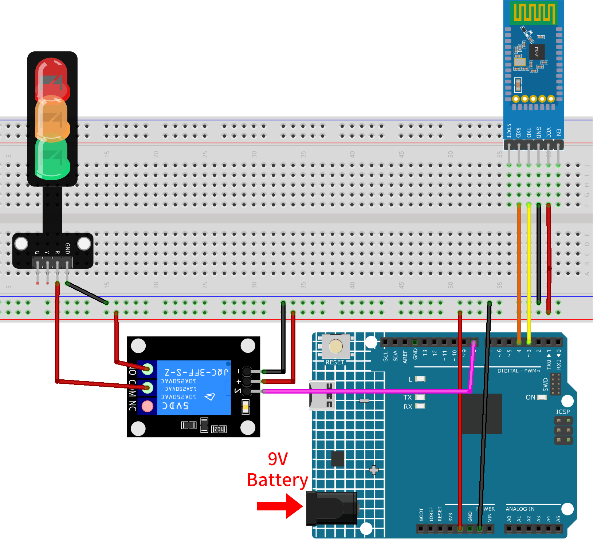

.. _iot_Bluetooth_voice_control_relay:

Bluetoothによる音声制御リレー
=================================

.. raw:: html

   <video controls style = "max-width:100%">
      <source src="../_static/video/iot/14-iot_Bluetooth_voice_control_relay.mp4"  type="video/mp4">
      お使いのブラウザはビデオタグをサポートしていません。
   </video>

このプロジェクトでは、MIT App Inventorを用いて開発したAndroidアプリとArduino Unoボードを連携させます。このアプリには音声入力機能が備わっています。ユーザーが「オン」という言葉を含む音声入力をすると、アプリはBluetooth経由で「1」というメッセージをArduinoに送信し、リレーをオンにするよう指示します。同様に、「オフ」という言葉を含む場合は、「0」というメッセージを送信して、リレーをオフにします。Arduinoはこれらのメッセージを受信した後、適切にリレーをオンまたはオフに制御します。

このAndroidアプリケーションは、|link_appinventor| と呼ばれる無料のWebベースのプラットフォームを使用して構築されます。このプロジェクトは、スマートフォンとArduinoを連携させる際の基本的な知識を得る絶好の機会となります。

1. 回路を組む
-----------------------------

.. warning ::
    以下の例は、リレーを用いて信号機モジュールを制御する方法を示しています。
    **実際の用途でリレーを他の機器に接続する場合、高電圧ACに関わる極度の注意が必要です。不適切または誤った使用は重傷や死につながる可能性があります。したがって、高電圧ACに精通している方のみが対象です。常に安全を最優先してください。**

* :ref:`cpn_uno`
* :ref:`cpn_jdy31`
* :ref:`cpn_relay`
* :ref:`cpn_traffic`

2. Androidアプリを作成する
-----------------------------

このAndroidアプリは、|link_appinventor| という無料のWebアプリケーションを用いて開発されます。MIT App Inventorは、直感的なドラッグアンドドロップ機能を備えており、シンプルなアプリケーションの作成に最適なスタート地点です。

それでは、始めましょう。

#. |link_appinventor_login| にアクセスして「online tool」をクリックしてログインします。MIT App Inventorに登録するにはGoogleアカウントが必要です。

   .. image:: img/new/09-ai_signup_shadow.png
       :width: 90%
       :align: center

#. ログインしたら、 **Projects** -> **Import project (.aia) from my computer** に進み、 ``ultimate-sensor-kit\iot_project\bluetooth\09-Bluetooth_voice_control_relay`` にある ``VoiceControl.aia`` ファイルをアップロードします。

   直接ダウンロードはこちらから: :download:`VoiceControl.aia</_static/other/VoiceControl.aia>`

   .. image:: img/new/09-ai_import_shadow.png
        :align: center

#. ``.aia`` ファイルをアップロードすると、MIT App Inventorのソフトウェア上でアプリケーションが表示されます。これは事前に設定されたテンプレートです。次の手順でMIT App Inventorに慣れた後、このテンプレートを自由に修正できます。

#. MIT App Inventorには **Designer** と **Blocks** という2つの主要なセクションがあります。ページの右上隅でこれらのセクションを切り替えることができます。

   .. image:: img/new/09-ai_intro_1_shadow.png

#. **Designer** は、ボタンやテキスト、画面など、アプリケーションの全体的な見た目を変更できる場所です。

   .. image:: img/new/14-ai_intro_2_shadow.png

#. 次に **Blocks** セクションです。ここでは、アプリのGUI上の各コンポーネントをプログラムして、目的の機能を実装できます。

   .. image:: img/new/14-ai_intro_3_shadow.png

   本プロジェクトでは、英語認識を例としています。他の言語の認識を適用したい場合、以下のコードブロックを修正して、自分でAPKをコンパイルする必要があります。

   まず、 ``SpeechRecognizer1.Language`` を認識したい言語の **language tag** に設定します。言語は、オプションの地域接尾辞を持つ言語タグ（例： ``en`` 、 ``de`` 、 ``ja`` ）を使用して指定します。言語タグは |link_language_tag| で見つけることができます。

   .. image:: img/new/14-ai_intro_3-1_shadow.png
      :width: 80%
      :align: center

   次に、対応する判断条件を修正する必要があります。以下の図で矢印で示されている部分です。

   .. image:: img/new/14-ai_intro_3-2_shadow.png
      :width: 80%
      :align: center

#. スマートフォンにアプリケーションをインストールするには、 **Build** タブに移動します。

   .. image:: img/new/08-ai_intro_4_shadow.png

   * ``.apk`` ファイルを生成できます。このオプションを選ぶと、 ``.apk`` ファイルをダウンロードするか、QRコードをスキャンしてインストールするかを選べるページが表示されます。インストールガイドに従ってアプリケーションのインストールを完了させてください。

     事前にコンパイルされたAPKはこちらからダウンロードできます: :download:`VoiceControl.apk</_static/other/VoiceControl.apk>`

   * Google Playや他のアプリマーケットにこのアプリをアップロードしたい場合は、 ``.aab`` ファイルを生成できます。

3. コードをアップロードする
-----------------------------

#. ``ultimate-sensor-kit\iot_project\bluetooth\09-Bluetooth_voice_control_relay`` パス下の ``14-Bluetooth_voice_control_relay.ino`` ファイルを開くか、このコードを **Arduino IDE** にコピーします。

   .. raw:: html
       
       <iframe src=https://create.arduino.cc/editor/sunfounder01/ab5f8fca-dd25-4e32-bf61-d5dc109bb6cd/preview?embed style="height:510px;width:100%;margin:10px 0" frameborder=0></iframe>

#. 正しいボードとポートを選択した後、 **書き込み** ボタンをクリックします。

#. シリアルモニター（ボーレートを **9600** に設定）を開き、デバッグメッセージを確認します。

4. アプリとBluetoothモジュールの接続
-----------------------------------------------

事前に作成したアプリケーションがスマートフォンにインストールされていることを確認します。

#. まず、スマートフォンの **Bluetooth** をオンにします。

   .. image:: img/new/09-app_1_shadow.png
      :width: 60%
      :align: center

#. スマートフォンの **Bluetooth設定** に移動し、 **JDY-31-SPP** のような名前を探します。

   .. image:: img/new/09-app_2_shadow.png
      :width: 60%
      :align: center

#. 見つけたら、ポップアップウィンドウ内で **ペアリング** リクエストに同意します。ペアリングコードが求められた場合は、「1234」を入力します。

   .. image:: img/new/09-app_3_shadow.png
      :width: 60%
      :align: center

#. 次に、新しくインストールされた **Voice-Controlled Relay** アプリを開きます。

   .. image:: img/new/14-app_4_shadow.png
      :width: 25%
      :align: center

#. アプリ内で **Connect** ボタンをクリックし、アプリとBluetoothモジュール間の接続を確立します。

   .. image:: img/new/14-app_5_shadow.png
      :width: 60%
      :align: center

#. このページには、すべてのペアリング済みBluetoothデバイスがリストされています。リストから ``xx.xx.xx.xx.xx.xx JDY-31-SPP`` オプションを選びます。各デバイスの名前はMACアドレスの隣に表示されます。

   .. image:: img/new/14-app_6_shadow.png
      :width: 60%
      :align: center

#. 上記のページにデバイスが表示されない場合、このアプリが近隣のデバイスをスキャンする権限を持っていない可能性があります。その場合は、設定を手動で調整する必要があります。

   * **アプリ情報** ページにアクセスするために、アプリアイコンを長押しして選択します。または、このページにアクセスする別の方法があれば、それを使用してもかまいません。

   .. image:: img/new/14-app_8_shadow.png
         :width: 60%
         :align: center

   * **許可** ページに移動します。

   .. image:: img/new/08-app_9_shadow.png
         :width: 60%
         :align: center

   * アプリが近隣のデバイスをスキャンできるようにするには、 **近隣のデバイス** に移動し、 **常時許可** を選択します。

   .. image:: img/new/08-app_10_shadow.png
         :width: 60%
         :align: center

   * その後、アプリを再起動し、手順5と6を繰り返してBluetoothに正常に接続します。

#. 接続に成功すると、メインページにリダイレクトされます。「ON」または「OFF」ボタンをクリックしてリレーの電源を入/切します。

   .. image:: img/new/14-app_7_shadow.png
      :width: 60%
      :align: center

   「on」または「off」といった短い音声入力による誤認識を避けるために、完全なフレーズ「turn on」や「turn on the light」といった音声コマンドの使用が推奨されます。

   音声認識機能はGoogleの音声認識エンジンに依存しているため、事前に |link_speech_recognition| をインストールする必要があるかもしれません（ほとんどのAndroid携帯にはこの機能がプリインストールされています）。

   .. image:: img/new/14-app_7-1_shadow.png
      :width: 60%
      :align: center

5. コードの説明
-----------------------------------------------

1. Bluetoothモジュールの通信設定

   .. code-block:: arduino
   
      #include <SoftwareSerial.h>
      const int bluetoothTx = 3;                           // BluetoothのTXは3ピンに接続
      const int bluetoothRx = 4;                           // BluetoothのRXは4ピンに接続
      SoftwareSerial bleSerial(bluetoothTx, bluetoothRx);  // SoftwareSerialオブジェクトをBluetooth通信用に宣言
   
   このセクションでは、SoftwareSerialライブラリを使ってBluetooth通信を初期化します。このライブラリにより、Arduinoは追加のシリアルポートを持つことができます。Bluetoothモジュールの"TX"ピンはArduinoの3ピンに、"RX"ピンは4ピンに接続されています。

2. 変数とリレー制御ピンの定義

   .. code-block:: arduino
   
      char character;  // Bluetoothシリアルから受信した文字
      String message;  // Bluetoothから受信した完全なメッセージを保存
      const int relayPin = 8;
   
   ここでは、Bluetoothから受信した個々の文字（``character``）と完全なメッセージ（``message``）を保存する変数を宣言します。 ``relayPin`` はリレー制御のために8ピンに初期設定されています。

3. シリアル通信の初期化とリレーのピンモード設定

   .. code-block:: arduino
   
      void setup() {
        Serial.begin(9600);
        bleSerial.begin(9600);
        pinMode(relayPin, OUTPUT);
      }

   ``setup()`` 関数内で、標準のシリアルポートとBluetoothのシリアルポートをボーレート9600で初期化します。また、 ``relayPin`` を出力ピンとして設定します。

4. Bluetoothメッセージの読み取りとリレー制御

   .. code-block:: arduino
   
      void loop() {
        while (bleSerial.available() > 0) {
          character = bleSerial.read();
          message += character;
          if (character == '#') {
            message = message.substring(0, message.length() - 1);
            Serial.println();
            Serial.print("DEBUG:");
            Serial.println(message);
            if (message == "1") {
              digitalWrite(relayPin, HIGH);
              Serial.println("On");
            } else if (message == "0") {
              digitalWrite(relayPin, LOW);
              Serial.println("Off");
            }
            message = "";
            delay(200);
          }
        }
      }

   ``loop()`` 関数では、Bluetoothからの着信メッセージを継続的にチェックします。メッセージが受信されると、各文字が ``message`` 文字列に追加されます。 ``#`` 文字が検出されると、メッセージは完全と見なされます。その後、 ``#`` を削除し、デバッグメッセージを出力、内容を確認します。内容が"1"であればリレーがオンになり、"0"であればオフになります。最後に ``message`` 文字列をクリアして、次のメッセージをチェックする前に短い待機を挟みます。
