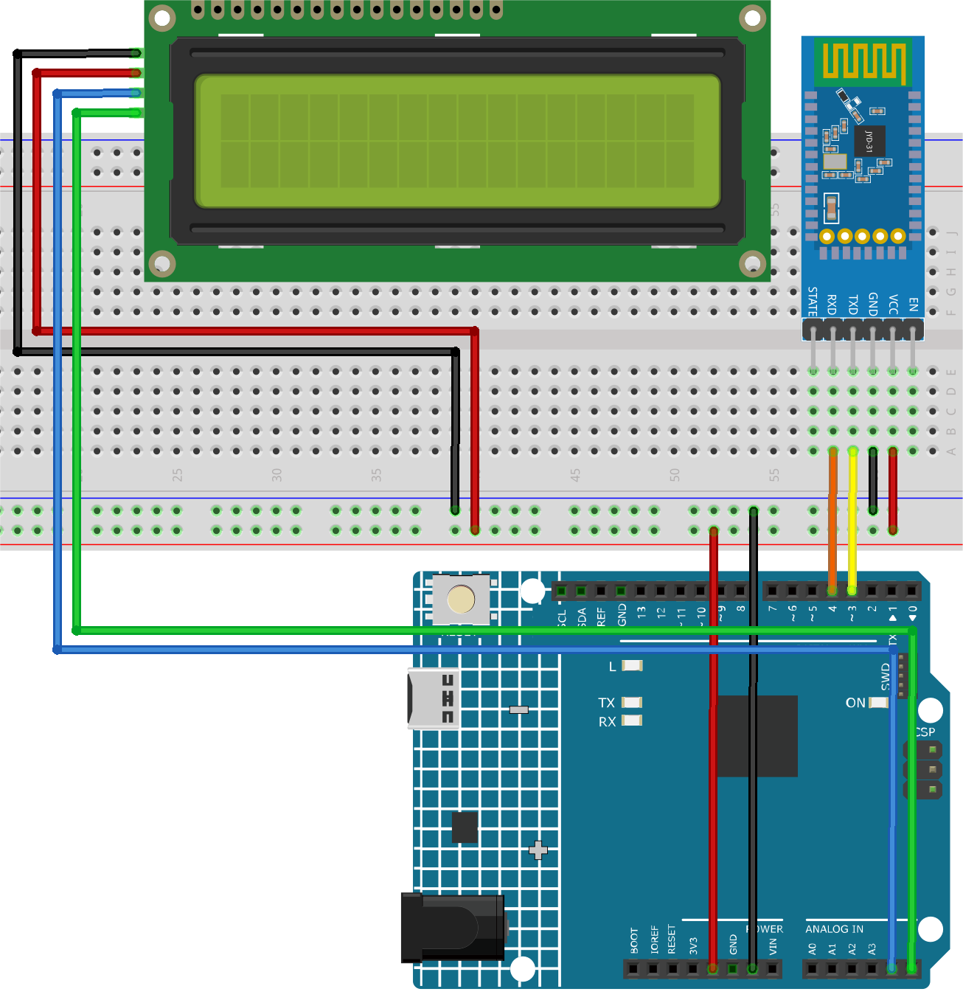

.. _iot_Bluetooth_lcd:

Bluetooth LCD
=============================

.. raw:: html

   <video loop autoplay muted style = "max-width:100%">
      <source src="../_static/video/iot/15-iot_Bluetooth_lcd.mp4"  type="video/mp4">
      Your browser does not support the video tag.
   </video>

The project receives messages through a Bluetooth module connected to the UNO board and displays the received messages on an LCD screen.

1. Build the Circuit
-----------------------------

* :ref:`cpn_uno`
* :ref:`cpn_jdy31`
* :ref:`cpn_i2c_lcd1602`

2. Upload the Code
-----------------------------

#. Open the ``01-Bluetooth_lcd.ino`` file under the path of ``ultimate-sensor-kit\iot_project\bluetooth\01-Bluetooth_lcd``, or copy this code into **Arduino IDE**.

   .. note:: 
      To install the library, use the Arduino Library Manager and search for **"LiquidCrystal I2C"** and install it.  

   .. raw:: html
       
       <iframe src=https://create.arduino.cc/editor/sunfounder01/9df5fa0e-9a98-40bb-9dd2-e22edb250bfa/preview?embed style="height:510px;width:100%;margin:10px 0" frameborder=0></iframe>

#. After selecting the correct board and port, click the **Upload** button.

#. Open the Serial monitor(set baudrate to **9600**) to view debug messages. 

3. App and Bluetooth module Connection
-----------------------------------------------
We can use an app called "Serial Bluetooth Terminal" to send messages from the Bluetooth module to Arduino.

a. **Install Serial Bluetooth Terminal**

   Go to Google Play to download and install |link_serial_bluetooth_terminal| .

b. **Connect Bluetooth**

   Initially, turn on **Bluetooth** on your smartphone.
   
      .. image:: img/new/09-app_1_shadow.png
         :width: 60%
         :align: center
   
   Navigate to the **Bluetooth settings** on your smartphone and look for names like **JDY-31-SPP**.
   
      .. image:: img/new/09-app_2_shadow.png
         :width: 60%
         :align: center
   
   After clicking it, agree to the **Pair** request in the pop-up window. If prompted for a pairing code, please enter "1234".
   
      .. image:: img/new/09-app_3_shadow.png
         :width: 60%
         :align: center
   

c. **Communicate with Bluetooth module**

   Open the Serial Bluetooth Terminal. Connect to "JDY-31-SPP".

   .. image:: img/new/00-bluetooth_serial_4_shadow.png 

d. **Send command**

   Use the Serial Bluetooth Terminal app to send messages to Arduino via Bluetooth. The message sent to Bluetooth will be displayed on the LCD.

   .. image:: img/new/15-lcd_shadow.png
      :width: 100%
      :align: center

4. Code explanation
-----------------------------------------------

.. note:: 
      To install library, use the Arduino Library Manager and search for **"LiquidCrystal I2C"** and install the library.  

#. Setting up the LCD

   .. code-block:: arduino

      #include <LiquidCrystal_I2C.h>
      LiquidCrystal_I2C lcd(0x27, 16, 2);

   This segment of code includes the LiquidCrystal_I2C library and initializes the LCD module with the I2C address as ``0x27`` and specifies that the LCD has ``16`` columns and ``2`` rows.

#. Setting up Bluetooth communication

   .. code-block:: arduino

      #include <SoftwareSerial.h>
      const int bluetoothTx = 3;
      const int bluetoothRx = 4;
      SoftwareSerial bleSerial(bluetoothTx, bluetoothRx);

   Here, the SoftwareSerial library is included to allow the JDY-31 Bluetooth module to communicate with the Arduino using pins 3 (TX) and 4 (RX).

#. Initialization

   .. code-block:: arduino

      void setup() {
         lcd.init();
         lcd.clear();
         lcd.backlight();

         Serial.begin(9600);
         bleSerial.begin(9600);
      }

   The ``setup()`` function initializes the LCD and clears any existing content. It also turns on the backlight for the LCD. Communication is started with the serial monitor and the Bluetooth module, both at a baud rate of ``9600``.

#. Main Loop

   .. code-block:: arduino

      void loop() {
         String data;

         if (bleSerial.available()) {
            data += bleSerial.readString();
            data = data.substring(0, data.length() - 2);
            Serial.print(data);

            lcd.clear();
            lcd.setCursor(0, 0);
            lcd.print(data);
         }

         if (Serial.available()) {
            bleSerial.write(Serial.read());
         }
      }

   This is the main operational loop of the Arduino program. It continually checks for incoming data from both the Bluetooth module and the serial monitor. When data is received from the Bluetooth device, it's processed, displayed on the serial monitor, and shown on the LCD. If data is entered into the serial monitor, this data is sent to the Bluetooth module.
