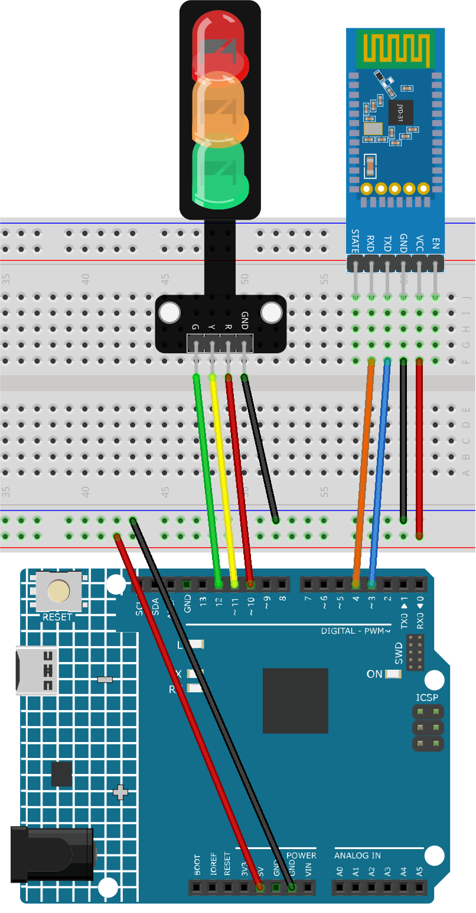

.. _iot_Bluetooth_traffic_light:

Bluetooth信号機
=============================

.. raw:: html

   <video loop autoplay muted style = "max-width:100%">
      <source src="../_static/video/iot/16-iot_Bluetooth_traffic_light.mp4"  type="video/mp4">
      ご利用のブラウザはビデオタグをサポートしていません。
   </video>

このプロジェクトは、Bluetooth通信を用いて交通信号機（赤、黄、緑のLED）を制御するように設計されています。ユーザーはBluetoothデバイスから文字（'R'、'Y'、'G'）を送信可能です。Arduinoがこれらの文字のいずれかを受信すると、対応するLEDが点灯し、他の2つのLEDは消灯状態に保たれます。

1. 回路を組む
-----------------------------

* :ref:`cpn_uno`
* :ref:`cpn_jdy31`
* :ref:`cpn_traffic`

2. コードをアップロード
-----------------------------

#. ``ultimate-sensor-kit\iot_project\bluetooth\02-Bluetooth_traffic_light`` のパスの下にある ``02-Bluetooth_traffic_light.ino`` ファイルを開くか、このコードを **Arduino IDE** にコピーします。

   .. raw:: html
       
       <iframe src=https://create.arduino.cc/editor/sunfounder01/e004fd36-1294-453e-b6fd-2bc7fc9410e8/preview?embed style="height:510px;width:100%;margin:10px 0" frameborder=0></iframe>

#. 正しいボードとポートを選択した後、 **書き込み** ボタンをクリックします。

#. シリアルモニターを開き（ボーレートを **9600** に設定）、デバッグメッセージを確認します。

3. アプリとBluetoothモジュールの接続
-----------------------------------------------

"Serial Bluetooth Terminal" というアプリを使用して、BluetoothモジュールからArduinoにメッセージを送ることができます。

a. **Serial Bluetooth Terminalをインストール**

   Google Playから |link_serial_bluetooth_terminal| をダウンロードしてインストールします。

b. **Bluetooth接続**

   まず、スマートフォンの **Bluetooth** をオンにします。
   
      .. image:: img/new/09-app_1_shadow.png
         :width: 60%
         :align: center
   
   スマートフォンの **Bluetooth設定** に移動し、 **JDY-31-SPP** のような名前を探します。
   
      .. image:: img/new/09-app_2_shadow.png
         :width: 60%
         :align: center
   
   クリックした後、ポップアップウィンドウで **ペアリング** のリクエストに同意します。ペアリングコードが求められた場合は、"1234"と入力します。
   
      .. image:: img/new/09-app_3_shadow.png
         :width: 60%
         :align: center

c. **Bluetoothモジュールと通信**

   Serial Bluetooth Terminalを開き、"JDY-31-SPP"に接続します。

   .. image:: img/new/00-bluetooth_serial_4_shadow.png 

d. **コマンド送信**

   Serial Bluetooth Terminalアプリを使用して、Bluetooth経由でArduinoにコマンドを送信します。Rで赤色のライトを点灯、Yで黄色、Gで緑色です。

   .. image:: img/new/16-R_shadow.png 
      :width: 85%
      :align: center

   .. image:: img/new/16-Y_shadow.png 
      :width: 85%
      :align: center

   .. image:: img/new/16-G_shadow.png 
      :width: 85%
      :align: center

4. コードの説明
-----------------------------------------------

#. 初期化とBluetoothの設定

   .. code-block:: arduino

      // Bluetoothモジュール通信の設定
      #include <SoftwareSerial.h>
      const int bluetoothTx = 3;
      const int bluetoothRx = 4;
      SoftwareSerial bleSerial(bluetoothTx, bluetoothRx);

   SoftwareSerialライブラリをインクルードして、Bluetooth通信を助けます。続いて、BluetoothモジュールのTXとRXピンをArduinoの3ピンと4ピンに関連付けます。最後に、Bluetooth通信用の ``bleSerial`` オブジェクトを初期化します。

#. LEDのピン定義

   .. code-block:: arduino

      // 各LEDのピン番号
      const int rledPin = 10;  // 赤
      const int yledPin = 11;  // 黄
      const int gledPin = 12;  // 緑

   ここでは、LEDが接続されているArduinoのピンを定義しています。赤いLEDは10ピン、黄色は11ピン、緑色は12ピンに接続されています。

#. setup()関数

   .. code-block:: arduino

      void setup() {
         pinMode(rledPin, OUTPUT);
         pinMode(yledPin, OUTPUT);
         pinMode(gledPin, OUTPUT);

         Serial.begin(9600);
         bleSerial.begin(9600);
      }

   ``setup()`` 関数内で、LEDのピンを ``OUTPUT`` として設定します。また、Bluetoothモジュールとデフォルトのシリアル（コンピュータに接続）の両方で9600のボーレートでシリアル通信を開始します。

#. Bluetooth通信のための主要なloop()関数

   .. code-block:: arduino

      void loop() {
         while (bleSerial.available() > 0) {
            character = bleSerial.read();
            Serial.println(character);

            if (character == 'R') {
               toggleLights(rledPin);
            } else if (character == 'Y') {
               toggleLights(yledPin);
            } else if (character == 'G') {
               toggleLights(gledPin);
            }
         }
      }

   主要な ``loop()`` 関数内で、Bluetoothモジュールからデータが利用可能かどうかを継続的にチェックします。データを受信した場合、その文字を読み取り、シリアルモニターに表示します。受信した文字（R、Y、またはG）に応じて、 ``toggleLights()`` 関数を使用して該当するLEDを切り替えます。

#. トグルライト関数

   .. code-block:: arduino

      void toggleLights(int targetLight) {
         digitalWrite(rledPin, LOW);
         digitalWrite(yledPin, LOW);
         digitalWrite(gledPin, LOW);

         digitalWrite(targetLight, HIGH);
      }

   この関数、``toggleLights()`` は、最初にすべてのLEDを消灯します。その後、指定されたターゲットのLEDのみを点灯させます。これにより、一度に一つのLEDだけが点灯するように保証されます。
